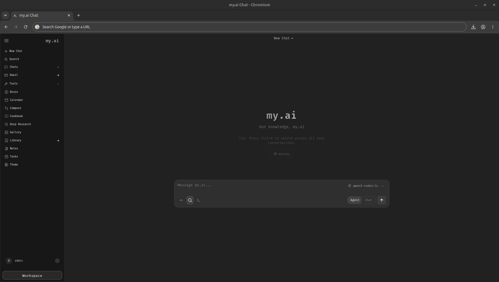

<h1 align="center">my.ai</h1>

<p align="center">
  A self-hosted, local-first AI workspace for chat, agents, research, documents, email, notes, calendar, and local model workflows.
</p>

<p align="center">
  <a href="#quick-start">Quick Start</a> ·
  <a href="docs/setup.md">Setup Guide</a> ·
  <a href="CONTRIBUTING.md">Contributing</a> ·
  <a href="ROADMAP.md">Roadmap</a>
</p>

<p align="center">
  
</p>

---

## Quick Start

```bash
git clone https://github.com/carmodyofficial-ops/my.ai.git
cd my.ai
cp .env.example .env
docker compose up -d --build
```

Open `http://localhost:7000` when the containers are healthy. The first admin password is printed in the app logs (`docker compose logs odysseus` — `odysseus` is the internal service name).

Native installs, GPU notes, Windows/macOS instructions, HTTPS, and configuration live in the [setup guide](docs/setup.md).

## Features

- **Chat + Agents** — local/API models, tools, MCP, files, shell, skills, and memory.
- **Cookbook** — hardware-aware model recommendations, downloads, and serving.
- **Deep Research** — multi-step web research with source reading and report generation.
- **Compare** — blind side-by-side model testing and synthesis.
- **Documents** — writing-first editor with AI edits, suggestions, Markdown, HTML, CSV, and syntax highlighting.
- **Email** — IMAP/SMTP inbox with triage, tags, summaries, reminders, and reply drafts.
- **Notes, Tasks + Calendar** — reminders, todos, scheduled agent tasks, and CalDAV sync.
- **Extras** — gallery/image editor, themes, uploads, web search, presets, sessions, and 2FA.

## What's Included

my.ai ships as a complete, runnable system — not just a framework.

**Application & engine**
- FastAPI app with a full agent loop, streaming chat, and an MCP-compatible tool runtime.
- Per-turn **automatic model routing** (coding / reasoning / quick-chat) with conversation stickiness, so each message goes to the right local model.
- Context management: adaptive input-token budget, mid-loop compaction, and a per-model context-window cap for low-RAM hosts.

**Tools (75+, admin-gated, sandboxed)**
- **Files:** read / write / edit / multi-edit / delete / move, grep / glob / ls.
- **Code:** `run_tests`, `git` (safe subcommands only), `lint_format`, `apply_patch`, and a RLIMIT-bounded code sandbox.
- **System & web:** secret-scrubbed shell + Python, web search, SSRF-guarded `http_request`, image generation, and document tools.

**Knowledge packs (47, curated & license-clean)** — retrieved automatically by relevance (keyword + semantic) and injected on-topic. Drop a new pack into `data/knowledge_packs/` and the manifest-driven retriever picks it up, no code change.
- **Languages (9):** Python, JavaScript/TypeScript, Go, Rust, Java/Kotlin, C/C++, C#/.NET, SQL, Bash
- **CS topics (8):** Git, API design, data structures & algorithms, concurrency & async, regex, performance, design patterns, secure coding
- **Frameworks (6):** React/Next.js, FastAPI/Django, Node/Express, web frontend, Godot/Unity, plus creative-coding technique
- **Game dev (4):** Roblox/Luau and HTML5-canvas — each with a complete worked example game
- **Official-doc distillations (9, license-verified):** Docker, TypeScript, pandas/NumPy, GitHub Actions, PostgreSQL, Tailwind, Svelte, Vite, FastAPI
- **Topic references (7):** software engineering, DevOps, data & databases, AI/LLM engineering, Kubernetes, networking & security, Linux
- **General (4):** technical writing, research methods, structured reasoning, product management

**Skills (14 method guides):** coding-method, debugging-method, test-authoring, refactoring, code-review, security-review, performance-optimization, git-workflow, understanding-a-codebase, creative-engineering, web-frontend, roblox-game-dev, repo-diagnostics, docker-service-debug.

**Agent integrations:** skills + API clients so external coding agents (**Claude Code**, **Codex**) can drive my.ai — see [`integrations/`](integrations/).

**Generated locally on first run (never shipped):** your database, accounts, settings, memory, uploads, and any models. See the [setup guide](docs/setup.md).

## AI Model Stack

my.ai runs entirely on local, self-hosted models — no cloud providers required. Models are served over OpenAI-compatible endpoints and selected per turn by the built-in auto model-router. The reference deployment uses two local endpoints:

| Endpoint | Kind | Models |
|---|---|---|
| `host:11434` | Ollama (local) | `gpt-oss:120b`-class default chat, `Qwen3-32B`, `gpt-oss:20b`, `mistral-small3.2:24b`, `qwen3-coder:30b`, plus an embedding model (`mxbai-embed-large`) |
| `host:8787` | OpenAI-compatible (local) | a fine-tuned coding/utility model |

**Role assignments**

- **Default chat** — the largest available model (120B-class).
- **Utility** (summarization, naming, routing) — a fast coding/utility model.
- **Embeddings** — `mxbai-embed-large` over HTTP, with an in-process FastEmbed (`all-MiniLM-L6-v2`) fallback.
- **Auto model-routing** — ON: each prompt is classified (coding / complex / simple) and delegated to the right model automatically.

Don't have a large workstation? The next section shows how to run the whole stack on ~18 GB of RAM.

## Running on Limited RAM (≈18 GB)

The default model routing targets a large workstation (a 120B + 30B + 20B). On a smaller machine — say **~18 GB of RAM** — swap in small local models. my.ai routes every turn to one of three configurable roles, so you only need models that fit.

**1. Pull a small model or two** (via the in-app **Cookbook**, or `ollama pull`):

| Role (setting) | Stock model | ~18 GB suggestion | Approx size (Q4) |
|---|---|---|---|
| `auto_model_coding` | `qwen3-coder:30b` | `qwen2.5-coder:7b` | ~4.7 GB |
| `auto_model_complex` | `gpt-oss:120b` | `qwen2.5:7b` *(or reuse the coder)* | ~4.7 GB |
| `auto_model_simple` | `gpt-oss:20b` | `llama3.2:3b` | ~2 GB |

Even simpler: point **all three roles at one 7–8B model** (e.g. `qwen2.5-coder:7b`). It handles coding, reasoning, and chat acceptably and uses ~5 GB. *(Model names are examples — check `ollama list` and the model cards; pick whatever runs well on your box.)*

**2. Set the models** in **Settings → Models** (or edit `data/settings.json`):
```json
{
  "auto_model_coding":  "qwen2.5-coder:7b",
  "auto_model_complex": "qwen2.5-coder:7b",
  "auto_model_simple":  "llama3.2:3b"
}
```

**3. Keep memory in check.** Tell Ollama not to hold several models at once — env vars, or a systemd drop-in on Linux (`/etc/systemd/system/ollama.service.d/override.conf`):
```ini
OLLAMA_MAX_LOADED_MODELS=1
OLLAMA_KEEP_ALIVE=30m
OLLAMA_NUM_PARALLEL=1
```

**4. Cap the context window** so a model doesn't reserve a huge KV cache. In **Settings** (or `data/settings.json`):
```json
{ "local_context_window_cap": 8192 }
```
8K is plenty for chat and most coding turns; drop to `4096` if memory is very tight. Remote/API models are never capped.

**5. (Optional) Trim bundled services.** ChromaDB and SearXNG each use some RAM. If you don't need vector memory or web search, comment them out in `docker-compose.yml` — embeddings fall back to the lightweight in-process FastEmbed model automatically.

**What to expect:** a 7B model (~5 GB) leaves comfortable headroom on 18 GB for the app plus a container. Generation is slower and answers are less capable than the stock large models, but chat, tool use, and the coding pipeline all work. Scale model sizes up as your hardware allows — routing and the context cap adapt to whatever you configure.

## Demo

A full hover-to-play tour lives on the landing page: [`docs/index.html`](docs/index.html).

## Contributing

Help is welcome. The best entry points are fresh-install testing, provider setup bugs, mobile/editor polish, docs, and small focused refactors. See [CONTRIBUTING.md](CONTRIBUTING.md) and [ROADMAP.md](ROADMAP.md).

## Security

my.ai is a self-hosted workspace with powerful local tools. Keep auth enabled, keep private data out of Git, and do not expose raw model/service ports publicly. Deployment details are in the [setup guide](docs/setup.md#security-notes).

## Star History

<a href="https://www.star-history.com/?repos=carmodyofficial-ops%2Fmy.ai&type=date&legend=top-left">
 <picture>
   <source media="(prefers-color-scheme: dark)" srcset="https://api.star-history.com/chart?repos=carmodyofficial-ops/my.ai&type=date&theme=dark&legend=top-left" />
   <source media="(prefers-color-scheme: light)" srcset="https://api.star-history.com/chart?repos=carmodyofficial-ops/my.ai&type=date&legend=top-left" />
   
 </picture>
</a>

## License

AGPL-3.0-or-later -- see [LICENSE](LICENSE) and [ACKNOWLEDGMENTS.md](ACKNOWLEDGMENTS.md).
