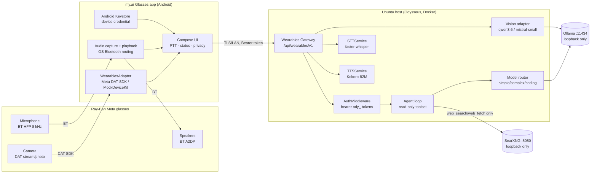

# Architecture — my.ai Glasses

## System diagram

## Backend components (all in this repo)

| Component | Path | Role |
|---|---|---|
| Route layer | `routes/wearables_routes.py` | `/api/wearables/v1/*`; scope gate, rate limits, SSE streaming, error normalization |
| Enrollment | `services/wearables_gateway/pairing.py` | one-time codes (sha256, TTL 300 s, single-use), device `ApiToken` mint/list/revoke |
| Sessions | `services/wearables_gateway/sessions.py` | transient in-memory conversations, owner-scoped, cancellable, idle-pruned |
| Spoken transform | `services/wearables_gateway/spoken.py` | markdown/URL/code → speakable prose, sentence-boundary truncation |
| Capabilities | `services/wearables_gateway/capabilities.py` | honest live component discovery incl. Ollama vision-capability probing |
| Errors | `services/wearables_gateway/errors.py` | stable client-facing error codes |

Integration points into the existing app (deliberately minimal):

1. `app.py` — router include; `/api/wearables/v1/pair` added to
   `AUTH_EXEMPT_EXACT`; streaming/media paths added to
   `_TIMEOUT_EXEMPT_PREFIXES`.
2. `routes/api_token_routes.py` — `"wearables"` added to `ALLOWED_SCOPES`.
3. `src/upload_limits.py` — `WEARABLES_IMAGE_MAX_BYTES` (env-tunable).

Nothing else in Odysseus was modified. The gateway calls only existing,
documented internals: `AuthMiddleware` (via normal request flow),
`resolve_endpoint`, `select_model_for_turn`, `stream_agent_loop`,
`llm_call_async`, `STTService`, `TTSService`.

## Conversation flow (`POST /respond`)

1. Scope gate (`wearables` bearer scope or cookie session) → owner.
2. Rate limit (30/min/owner). Validate text ≤ 4000 chars.
3. Transient session created/reused (owner-scoped; hostile session ids can
   never join another owner's context — a colliding id mints a fresh one).
4. Default endpoint resolved; per-turn auto model routing (same router as the
   web UI: simple/complex/coding).
5. `stream_agent_loop` runs with `relevant_tools={web_search, web_fetch}`,
   a hard `disabled_tools` deny-set, `max_rounds=6`, and
   `trusted_execution=False` — so the existing safe-abstention /
   anti-injection machinery stays fully active. The glasses channel can never
   execute shell/file/memory tools.
6. SSE frames: `wearables_meta` → passthrough agent frames (`delta`,
   `agent_prep`, tool events) → `spoken` (markdown-stripped, length-bounded,
   thinking-deltas excluded) → `done` → `[DONE]`.
7. Cancellation: `POST /session/{id}/cancel` sets an event raced against the
   upstream generator; the upstream LLM stream is closed via `aclose()`.
   Dropping the SSE connection cancels too (Starlette generator semantics).

## Mobile architecture (Android-first)

- Kotlin + Jetpack Compose + Coroutines/Flow + OkHttp SSE.
- `WearablesAdapter` interface isolates ALL Meta SDK types; two
  implementations: `MetaDatAdapter` (real SDK) and `MockWearablesAdapter`
  (no hardware / CI). The rest of the app depends only on the interface.
- `GatewayClient` speaks the OpenAPI contract; `CredentialStore` wraps
  Android Keystore. Connection state is a reducer (`ConnectionReducer`) so
  it is unit-testable without Android instrumentation.
- Audio: mic capture via OS Bluetooth HFP routing
  (`AudioManager.setCommunicationDevice`, API 31+); TTS playback via A2DP.
  HFP and A2DP are mutually exclusive while the mic is open (SDK reality —
  see META_SDK_CAPABILITY_MATRIX.md §10), so the voice loop toggles profiles
  between listen and speak turns.

## Latency stages (measured points)

`glasses→phone audio start` and `BT` stages are hardware-dependent (not yet
measured — no hardware in this environment). Backend stages measured live
2026-07-12 (see ENGINEERING_TURNOVER.md): enrollment round-trip < 1 s;
text request → first SSE frame ≈ 1 s (warm model); vision cold-load 56 s /
warm expected a few seconds; full simple answer (20B) ≈ 6 s.
